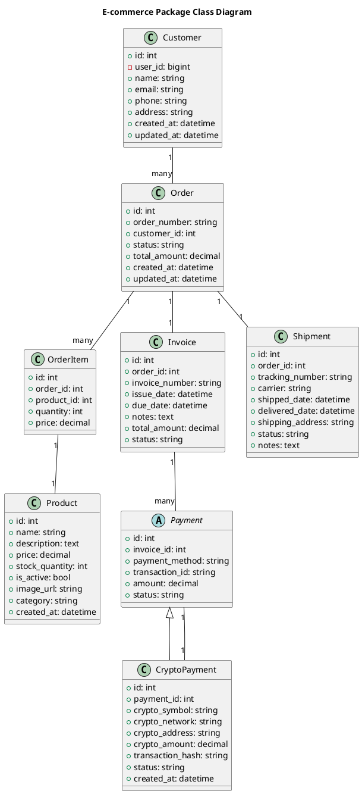

# Laravel Simple Cart 
## Design 
Entity-Relationship Diagram (ERD) and Class Diagram for the E-commerce Package.

```puml
@startuml
title E-commerce Package Class Diagram 

'------------------------
' Base Entities
'------------------------

class Customer {
  +id: int
  -user_id: bigint
  +name: string
  +email: string
  +phone: string
  +address: string  
  +created_at: datetime
  +updated_at: datetime
}

class Product {
  +id: int
  +name: string
  +description: text
  +price: decimal
  +stock_quantity: int
  +is_active: bool
  +image_url: string
  +category: string
  +created_at: datetime
}

class Order {
  +id: int
  +order_number: string
  +customer_id: int
  +status: string
  +total_amount: decimal
  +created_at: datetime
  +updated_at: datetime
}

class OrderItem {
  +id: int
  +order_id: int
  +product_id: int
  +quantity: int
  +price: decimal
}

class Invoice {
  +id: int
  +order_id: int
  +invoice_number: string
  +issue_date: datetime
  +due_date: datetime
  +notes: text
  +total_amount: decimal
  +status: string
}

'------------------------
' Payment and Subclass
'------------------------

abstract class Payment {
  +id: int
  +invoice_id: int
  +payment_method: string
  +transaction_id: string
  +amount: decimal  
  +status: string
}

class CryptoPayment {
  +id: int
  +payment_id: int
  +crypto_symbol: string
  +crypto_network: string
  +crypto_address: string
  +crypto_amount: decimal
  +transaction_hash: string
  +status: string
  +created_at: datetime
}

Payment <|-- CryptoPayment

'------------------------
' Shipment
'------------------------

class Shipment {
  +id: int
  +order_id: int
  +tracking_number: string
  +carrier: string
  +shipped_date: datetime
  +delivered_date: datetime
  +shipping_address: string
  +status: string
  +notes: text
}

'------------------------
' Relationships
'------------------------

Customer "1" -- "many" Order
Order "1" -- "many" OrderItem
Order "1" -- "1" Invoice
Invoice "1" -- "many" Payment
Order "1" -- "1" Shipment
OrderItem "1" -- "1" Product
CryptoPayment "1" -- "1" Payment

@enduml
```